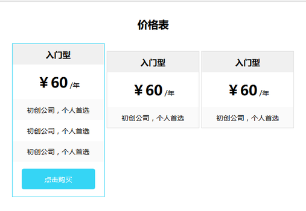

# kicw 报价表



## 类

| 类 | 修饰 | 说明
|----|------|----
| .kicw         | | 主类
| .kicw         | .stripped | row部分使用奇偶行斑马纹
| .kicw-2       | | 每行2个item
| .kicw-3       | | 每行3个item
| .kicw-4       | | 每行4个item
| .kicw-5       | | 每行5个item
| .kicw-6       | | 每行6个item
| .kicw-7       | | 每行7个item
| .kicw-8       | | 每行8个item
| .kicw-item    | | 一个报价方案
| .kicw-head    | | item头
| .kicw-foot    | | item尾
| .kicw-row     | | 行
| .kicw-row     | .x      | 字体加大1
| .kicw-row     | .xx     | 字体加大2
| .kicw-row     | .xxx    | 字体加大3
| .kicw-row     | .s      | 字体减小1
| .kicw-row     | .b      | 粗体
| .kicw-row     | .line1      | 1行高（供不同item高度对齐用）
| .kicw-row     | .line2      | 2行高
| .kicw-row     | .line3      | 3行高
| .kicw-row     | .line4      | 4行高
| .kicw-ribbon | | 飘带

## 层次关系

```
.kicw [.kicw-4] [.stripped]
    .kicw-item
        .kicw-head
        .kicw-row
        .kicw-row
        .kicw-row
        .kicw-foot
```